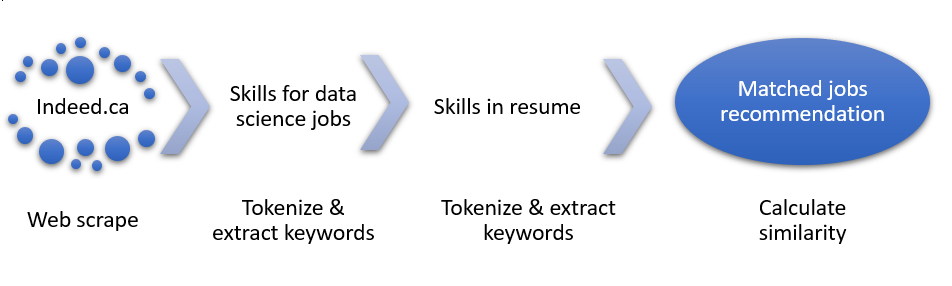

# Job Recommendation By Skill Match


Build a simple data-science-skill-keyword-based job recommendation engine, which match keywords from resume to data science jobs in major Canadian cities.

## Install

This project requires **Python 3.0+** and the following Python libraries installed:

- [NumPy](http://www.numpy.org/)
- [Pandas](http://pandas.pydata.org)
- [matplotlib](http://matplotlib.org/)
- [NLTK Stopwords](https://www.nltk.org/book/ch02.html)
- [Selenium](https://www.seleniumhq.org/)
- [PyPDF2](https://pythonhosted.org/PyPDF2/)

## Code

Code is provided in 
- indeed_job_recommendation.py
- skill_keyword_match.py
- web_scrapper.py

## Run

In a terminal or command window, navigate to the top-level project directory `Job-recommendation-by-skill-match/` and run one of the following commands:

Search and match jobs in all cities:
```python indeed_job_recommendation.py```

Search and match jobs in one city e.g. Vancouver,BC:
```python indeed_job_recommendation.py Vancouver,BC```

When finishes successfully, it will say 'File of recommended jobs saved'.

## Data
Data collected from indeed.ca - data science jobs posted in the last 30 days in 6 big Canadian cities. 

## Project workflow

